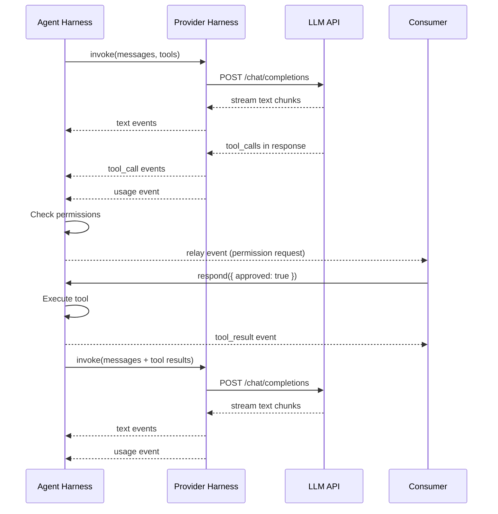

## What is a harness?

A harness is an async generator function that yields events during LLM invocations. It's the core abstraction in LLM Gateway — everything from a single API call to a multi-agent orchestration is built by composing harnesses.

```typescript
interface GeneratorHarnessModule {
  invoke(params: GeneratorInvokeParams): AsyncIterable<HarnessEvent>;
  supportedModels(): Promise<string[]>;
}
```

Harnesses implement a simple contract:
- `invoke()` takes messages, tools, and configuration, returns an async iterable of events
- `supportedModels()` returns the list of model IDs the harness can handle

## Two types of harnesses

### Provider harnesses

Provider harnesses make **single LLM API calls** and stream the results. They handle one request-response cycle and yield events like `text`, `reasoning`, `tool_call`, and `usage`.

<CodeGroup>
```typescript Single API call with Zen provider
import { createGeneratorHarness } from "./packages/ai/harness/providers/zen";

const harness = createGeneratorHarness();

for await (const event of harness.invoke({
  model: "glm-4.7",
  messages: [{ role: "user", content: "What is 2+2?" }],
})) {
  if (event.type === "text") {
    process.stdout.write(event.content);
  }
}
```

```typescript With reasoning and usage
for await (const event of harness.invoke(params)) {
  switch (event.type) {
    case "reasoning":
      console.log("[thinking]", event.content);
      break;
    case "text":
      process.stdout.write(event.content);
      break;
    case "usage":
      console.log(`Tokens: ${event.inputTokens}/${event.outputTokens}`);
      break;
  }
}
```
</CodeGroup>

Available provider harnesses:

<CardGroup cols={2}>
  <Card title="Zen" icon="circle-nodes" href="/api/harnesses/zen">
    OpenAI-compatible API with support for reasoning content. Default provider.
  </Card>
  <Card title="Anthropic" icon="message" href="/api/harnesses/anthropic">
    Claude models via the Anthropic Messages API.
  </Card>
  <Card title="OpenAI" icon="bolt" href="/api/harnesses/openai">
    GPT models via OpenAI Chat Completions API.
  </Card>
  <Card title="OpenRouter" icon="route" href="/api/harnesses/openrouter">
    Access 100+ models through OpenRouter aggregator.
  </Card>
</CardGroup>

### Agent harness

The agent harness wraps a provider harness to add **agentic behavior**: tool execution, permission checking, and an iterative loop that continues until the model has no more tool calls.

```typescript Agent harness wrapping Zen provider
import { createAgentHarness } from "./packages/ai/harness/agent";
import { createGeneratorHarness } from "./packages/ai/harness/providers/zen";
import { bashTool } from "./packages/ai/tools";

const agent = createAgentHarness({ 
  harness: createGeneratorHarness(),
  maxIterations: 10 
});

for await (const event of agent.invoke({
  model: "glm-4.7",
  messages: [{ role: "user", content: "List files in this directory" }],
  tools: [bashTool],
  permissions: { allowlist: [{ tool: "bash" }] }
})) {
  if (event.type === "tool_call") {
    console.log(`[calling ${event.name}]`);
  }
  if (event.type === "tool_result") {
    console.log(`[result]`, event.output);
  }
  if (event.type === "text") {
    process.stdout.write(event.content);
  }
}
```

The agent harness adds:
- **Agentic loop**: Continues calling the LLM until no tool calls remain or `maxIterations` is reached
- **Permission handling**: Checks allowlists, yields relay events, waits for approval
- **Tool execution**: Executes approved tools with proper context and error handling
- **Message history**: Builds up the conversation with assistant responses and tool results

## Event flow

A typical agentic conversation produces this event sequence:



## Lifecycle events

Agent harnesses emit lifecycle events to mark the boundaries of their execution:

<ParamField path="harness_start" type="event">
  Marks the beginning of an agent run. Contains `runId` and optional `depth` and `maxIterations` for nested invocations.
</ParamField>

<ParamField path="harness_end" type="event">
  Marks the end of an agent run. Contains `runId`, optional `reason` ("final" or "max_iterations"), and usage totals for RLM harness.
</ParamField>

```typescript Lifecycle tracking
let isRunning = false;

for await (const event of agent.invoke(params)) {
  if (event.type === "harness_start") {
    isRunning = true;
    console.log(`Agent ${event.runId} started`);
  }
  if (event.type === "harness_end") {
    isRunning = false;
    console.log(`Agent ${event.runId} finished`);
  }
}
```

## Harness parameters

The `invoke()` method accepts these parameters:

<ParamField path="model" type="string" required>
  Model ID to use for LLM calls (e.g., "glm-4.7", "claude-3.5-sonnet").
</ParamField>

<ParamField path="messages" type="Message[]" required>
  Conversation history. Each message has `role` ("system", "user", "assistant", "tool") and `content`.
</ParamField>

<ParamField path="tools" type="ToolDefinition[]">
  Tools available to the agent. Each tool has a name, description, Zod schema, and optional `execute()` function.
</ParamField>

<ParamField path="permissions" type="Permissions">
  Permission rules. Contains `allowlist`, `allowOnce`, and `deny` arrays for controlling tool access.
</ParamField>

<ParamField path="env" type="object">
  Environment context:
  - `parentId`: Links this run to a parent (for subagents)
  - `spawn`: Function to spawn subagents
  - `fileTime`: File timestamp tracking utility
</ParamField>

## Creating custom harnesses

You can create custom harnesses for specialized behavior:

<CodeGroup>
```typescript Retry harness
async function* retryHarness(
  baseHarness: GeneratorHarnessModule,
  maxRetries = 3
) {
  return {
    async *invoke(params: GeneratorInvokeParams) {
      let attempt = 0;
      while (attempt < maxRetries) {
        try {
          for await (const event of baseHarness.invoke(params)) {
            if (event.type === "error") {
              attempt++;
              if (attempt >= maxRetries) yield event;
              break;
            }
            yield event;
          }
          return; // Success
        } catch (error) {
          attempt++;
          if (attempt >= maxRetries) {
            yield { type: "error", runId: "", error };
          }
        }
      }
    },
    supportedModels: () => baseHarness.supportedModels()
  };
}
```

```typescript Logging harness
function createLoggingHarness(
  baseHarness: GeneratorHarnessModule
): GeneratorHarnessModule {
  return {
    async *invoke(params: GeneratorInvokeParams) {
      console.log("[invoke]", { model: params.model });
      
      for await (const event of baseHarness.invoke(params)) {
        console.log("[event]", event.type);
        yield event;
      }
      
      console.log("[complete]");
    },
    supportedModels: () => baseHarness.supportedModels()
  };
}
```
</CodeGroup>

<Info>
See [Composition](/concepts/composition) to learn how to layer harness behavior, and [Custom Harnesses](/extensions/custom-harness) for detailed implementation patterns.
</Info>

## Key characteristics

<AccordionGroup>
  <Accordion title="Composable">
    Harnesses wrap other harnesses. The agent harness wraps a provider harness. You can add retries, logging, rate limiting, or caching by wrapping harnesses around each other.
  </Accordion>
  
  <Accordion title="Streaming by default">
    Events arrive as they're produced. Text streams token-by-token. Tool calls stream as the model emits them. No buffering unless you choose to collect events.
  </Accordion>
  
  <Accordion title="Type-safe">
    Events are a discriminated union type. Tools use Zod schemas for runtime validation. TypeScript provides autocomplete for event fields.
  </Accordion>
  
  <Accordion title="Provider-agnostic">
    The same agent code works with any provider. Swap Zen for Anthropic or OpenAI by changing one line. Model-specific features (like reasoning) surface as events when available.
  </Accordion>
</AccordionGroup>

## Next steps

<CardGroup cols={2}>
  <Card title="Events" icon="bolt" href="/concepts/events">
    Learn about the event types that flow through harnesses
  </Card>
  <Card title="Composition" icon="layer-group" href="/concepts/composition">
    Understand how to layer harness behavior
  </Card>
  <Card title="Agent API" icon="book" href="/api/harnesses/agent">
    Full API reference for the agent harness
  </Card>
  <Card title="Custom Provider" icon="wrench" href="/extensions/custom-provider">
    Build a custom provider harness
  </Card>
</CardGroup>